# K1. Sound processing in Frequency Domain

## Joseph Fourier

Fourier was a French mathematician and physicist born in Auxerre and best known for initiating the investigation of Fourier series, which eventually developed into Fourier analysis and harmonic analysis, and their applications to problems of heat transfer and vibrations. The Fourier transform and Fourier's law of conduction are also named in his honour.

## Fourier Theorem

The French mathematician Joseph Fourier demonstrated that any periodic wave can be expressed as the sum of harmonically related sinusoids, each with its own **amplitude** and **phase**. Given a digital representation of a periodic wave, one can employ a formula known as the discrete Fourier transform (DFT) to calculate the frequency, phase, and amplitude of its sinusoidal components. Essentially, the DFT transforms a time-domain representation of a sound wave into a frequency- domain spectrum. This spectrum can also be transformed back into a time-domain waveform.

## Time domain vs Frequency domain

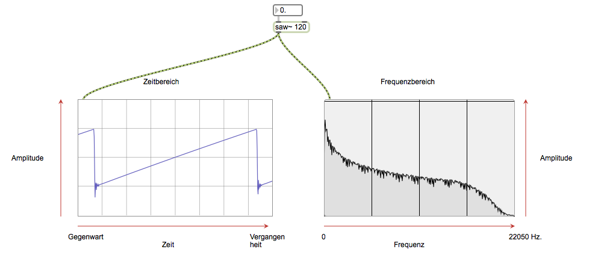

spectroscope~ is a frequency domain visualizer. 

## Applications

By using FFT in Max, we are capable of executing following processing.
- Spectrum Analysis
- Spectral EQ
- Spactral Gate
- Spectral Compressor
- Spectral Expander
- Spectral Limitter
- Spectral Shift
- Spectral Scale
- Spectral Freeze
- Spectral Crossfade
- Spectral Mixing
- Spectral Delay
- Spectral Decay
- Spectral Spatialization
- Spectral Order Randomization
- Cross-Synthesis
- Timbre Identification
- Phase Vocoder

and more

## FFT Objects
### fft~ and ifft~

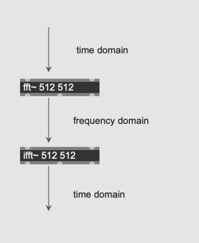

Ifft ... inverse FFT.

**FFT** converts time domain data to frequency domain data  
**IFFT** converts frequency domain data to time domain data

### Assignment 1

In max, the most basic objects for fft and ifft are [fft~] and [ifft~].  
Learn those two objects and insert [fft~] and [ifft~] between the [cycle~ 440] and [ezdac~] in the patch below, in order to convert the time domain data to frequency domain and convert back the frequency domain data to time domain data.  
The output sound should be exactly the same as the original patch after the insertion.

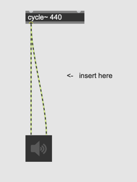

Hint: [fft~] and [ifft~] require arguments

### Assignment 2

use [capture~] and analyze the output coming from two outlets of [fft~] and observe the characteristics of the number printed on the Max console.

### Arguments for [fft~] and [ifft~] objects
- number of FFT samples ... The number of samples in the FFT it must be a power of two.
- spectral frame size ... the number of samples between successive FFTs. This must be at least the number of FFT samples and must be a power of two. This argument almost always equals to number of FFT samples.

If [fft~ 512 2048] the frequency domain data is generated only once per every four FFT blocks.

### What does [fft~] do exactly?

fft- receives a signal in its inlet. For each slice of time it receives (512 samples long by default) it sends out a signal of the same length listing the amount of energy in each frequency region. The signal that comes out of fft- is not anything you're likely to want to listen to. Rather, it's a list of relative amplitudes of 512 different frequency bands in the received signal. This 'list' happens to be exactly the same length as the samples received in each time slice, so it comes out at the same rate as the signal comes in. The signal coming out of fft- is a frequency-domain analysis of the samples it received in the previous time slice.

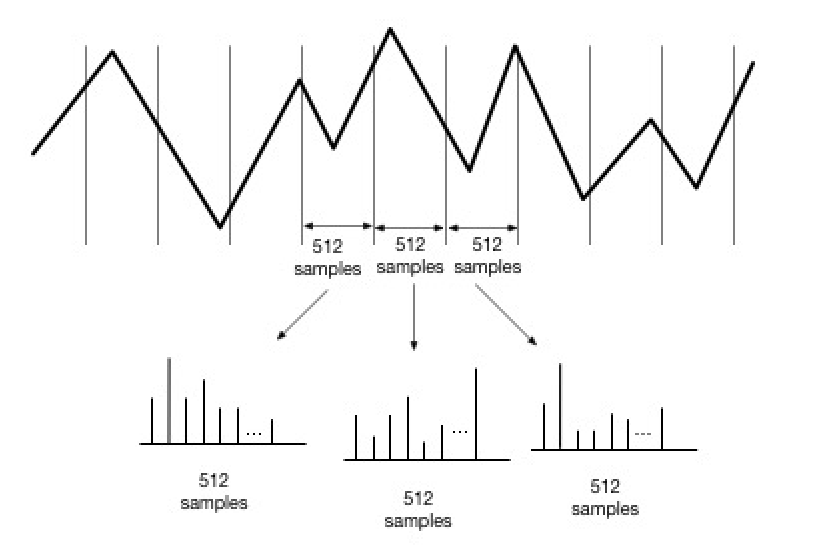

This means 
- the higher the FFT size becomes, the higher resolution we get in the spectral data
- the higher the FFT size becomes, the more samples are needed to be cached before the conversion, thus, the longer the delay time.

The FFT size controls the trade-off between these two parameters

### more FFT terminologies
#### bin
Each sample output from [fft~] represents the energy of frequency region.
First sample represents the energy from 0-86.1 Hz the next sample represents the energy from 86.1-172.2 Hz etc. We use a special term *bin* to express the samples in the frequency domain in order to distinguish it from the usual audio samples.

#### Aliasing
The data coming from fft~ covers the entire frequency range of the SR. Thus, the content of the spectral data is aliased. If fft size is 512. the content of bin 0-255 are mirrored in bin 256- 511.

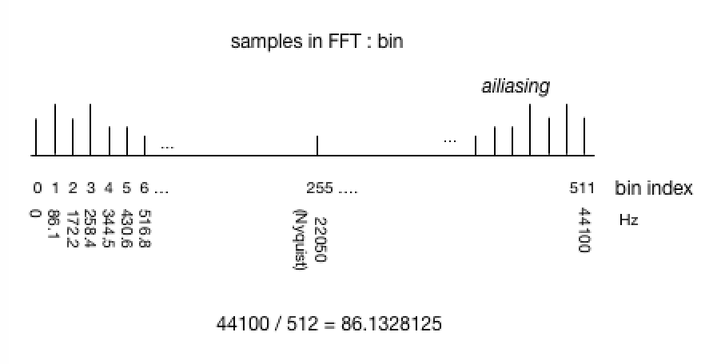

### Why does fft~ offer two outlets

Actually, the analysis produced by fft~ outputs two parallel signals. That's because the math involved produces **complex numbers**, which have a **real** and **imaginary** component. The real components are output from the left outlet and the imaginary components from the middle. Both signals are required for spectral processing.

### Complex plane
Complex number is a pair of real and imaginary numbers. Thus, it is helpful to express it visually on a 2D complex plane. 

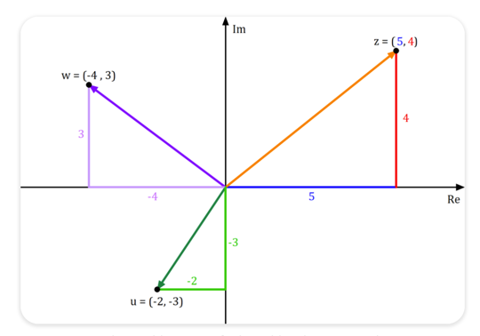

x = real  
y = imaginary

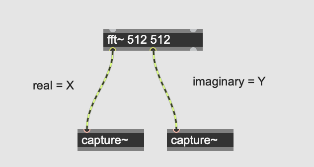

The output from [fft~] can be plotted on a complex plane.
In other words, we receive 512 points on the complex plane in one FFT block if the FFT size is 512.

### Summary

- [fft~] converts time domain data to frequency domain data
- [fft~] outputs two streams of numbers because frequency domain data is expressed as pairs of numbers; real and imaginary number

### How can we extract the data of frequency spectrum from those two number (real - imaginary)?

### Assignment 3

The **distance** from the center of the complex plane and the points given by fft~ represents the energy of each frequency region. The distance is sometimes called **Magnitude**.  

In the patch below, calculate the distance of each bin and visualize them in a waveform~ by storing them in a [buffer~ spectrum]

Hint 1: Pythagorean theorem  
Hint 2: the third outlet of fft~ outputs bin index from 0 to 511.  
Hint 3: [poke~] allows us to set a number in the specified buffer~ using signal  

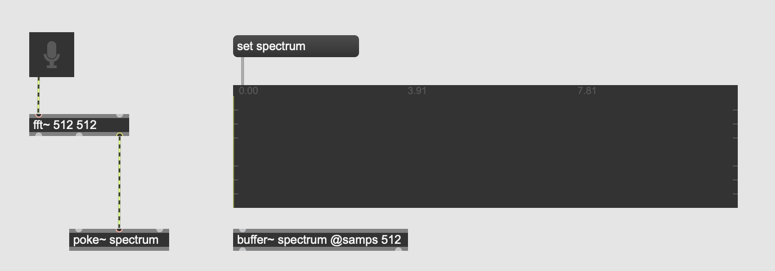

### The Problem : Phase aligned vs Phase unaligned Signal

### Assignment 4
When SR = 44100, How large is one frequency region that one FFT bin covers when FFT size is 512?  
When SR = 48000, How large is one frequency region that one FFT bin covers when FFT size is 1024?  
When SR = 96000, How large is one frequency region that one FFT bin covers when FFT size is 256?

### Assignment 5
Use the patch we created in assignment 3 and visualize the spectrum of sine waves whose frequency is multiple of the frequency region size. compare that with non-multiple of frequency region size.

### The cause of the problems observed in Assignment 5

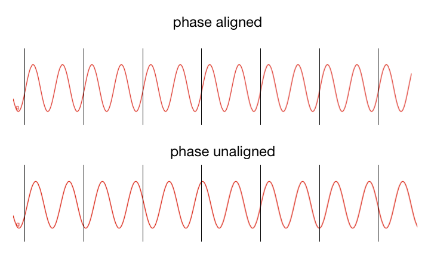

The FFT algorithm assumes that the FFT block being analyzed comprise one cycle of periodic wave. If the frequency of the sine wave is aligned to the fundamental frequency of the FFT (512 samples in 44.1k = 86.1328 Hz) it works fine but in most cases, the 512 samples of the FFT will not be precisely one cycle of the wave. When that happens, the FFT still analyzes the 512 samples as if they were one cycle of a waveform, and reports the spectrum of that wave. Such an analysis will contain many spurious frequencies not actually present in the signal.

### The solution = Windowing

By applying windowing function (fadein-fadeout that is aligned to the size of FFT) we can make any kind of signal an aligned signal. For that we usually use the hanning window.

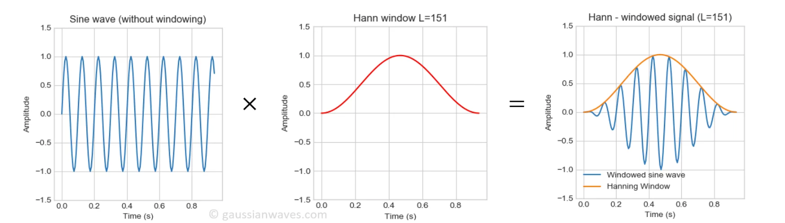

### Assignment 6

Load the [hanning.aif](k1/hanning.aif) to the patch of assignment 5, apply it to the signal before [fft~] and solve the problem.

### The problem of windowing 

[voice sample](k1/spoken.wav)

- Applying hanning window solves phase alignment problem but hanning window generates unwanted amplitude-modulation-like sound effect, when we convert it back to time domain data

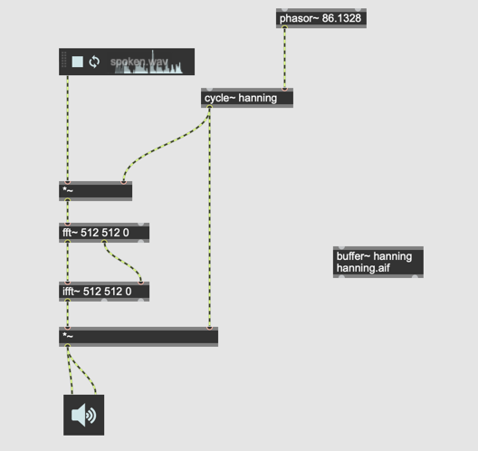

### The solution against the tremolo effect

OLA ... overlap and add. 
Make a copy of [fft~] and [ifft~] pair and deploy it with a certain amount of delay. 
In this way, we can compensate for the silence that windowing produces.

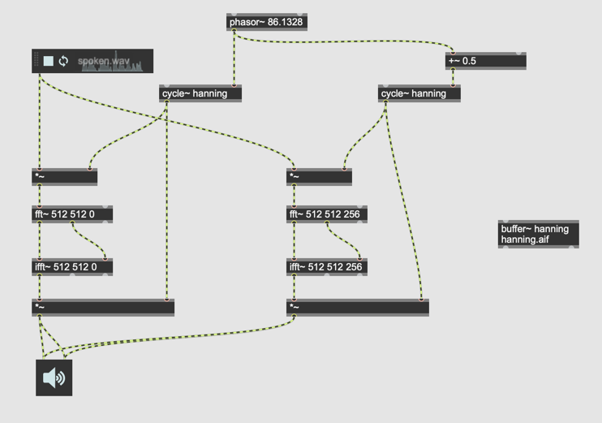

### pfft~

In many FFT applications, we need **windowing** and **OLA**. With pfft~, we can implement both of them without programing them. 

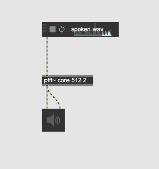  
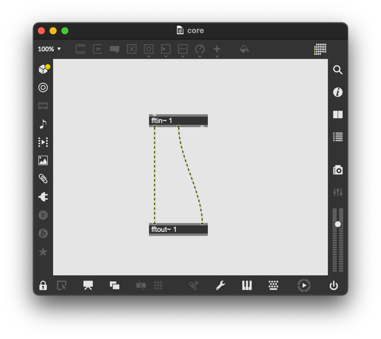

where 512 = FFT size, 2 = number of overlaps

### Assignment 7: Configuring [pfft~]

- change the size of FFT to 1024, 2048, 4096, 8192
- change the number of overlap to 1, 2, 4, 8
- change the windowing algorithm by adding the second argument to [fftin~] and [fftout~]
- disconnect the imaginary output of [fftin~] to imaginary input of [fftout~]

### Further References

- Youtube [but what is FFT](https://www.youtube.com/watch?v=spUNpyF58BY)

- MSP Analysis Tutorial 3: Using the FFT
- MSP Analysis Tutorial 4: Signal Processing with pfft~