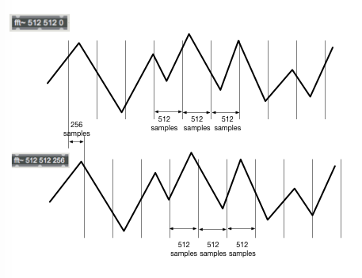

# Klangverarbeitng im Frequenzbereich

## Tutorials

- MSP Analysis Tutorial 3: Using the FFT
- MSP Analysis Tutorial 4: Signal Processing with pfft~

## Joseph Fourier

## Fourier Theorem

MSP Analysis Tutorial 3: Using the FFT

## Zeitbereich vs Frequenzbereich

spectroscope~ ist eine Anzeige. Man kann damit nicht das Spektrum ändern.

## Anwendungen

- Analyze
- Spectral EQ
- Spactral Gate
- Spectral Compressor
- Spectral Expander
- Spectral Limitter
- Spectral Shift
- Spectral Scale
- Spectral Freeze
- Spectral Crossfade
- Spectral Mixing
- Spectral Delay
- Spectral Decay
- Spectral Spatialization
- Spectral Order Randomization
- Cross-Synthesis
- Timbre Identification
- Phase Vocoder

## FFT Objekte
### fft~ und ifft~

ifft ... inverse FFT.

#### Arg1: Window size

Window size = Anzahl von Samples (Abtaste) für eine FFT-Analyze

- FFT Windows size muss 2 hoch n sein.

#### Arg2: Spectral Frame size
Fast immer
Window Size = Spectral Frame Size

#### Arg3: Hop size

FFT Frame Offset

Das ist nötig wenn die OLA-Technik verwendet wird

## Was fft~ ganau macht

### Einzelheit

### Warum hat fft~ zwei Ausgänge?

Gaußsche Zahlenebene  

Die Ausgaben von fft~ k￿önnen als Punkte auf der Gaußschen Zahlenebene intepretiert werden.

### Wie kann man von zwei Singals die Daten des Spektraums konsturieren?

### Das Problem : Phase aligned vs Phase unaligned Signal

#### 8613.28125 Hz = 86.1328125 * 100

(Phase aligned - eine Linie)

#### 8500 Hz

(Phase unaligend - Fehler)

### Die Ursache des Problems

### Die Lösung fürs Problem

Granularsynthese-Technik

- Fensturfunktion
- Overlap and Add

### Fensterfunktion

### Overlap and Add

#### Ohne OLA

#### Mit OLA

