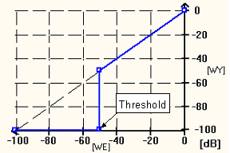
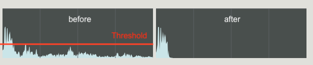
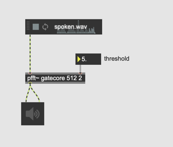
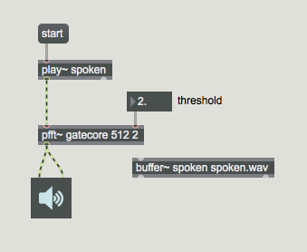
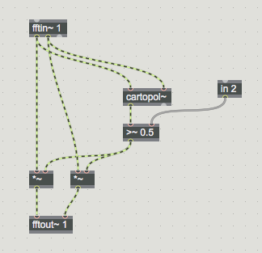
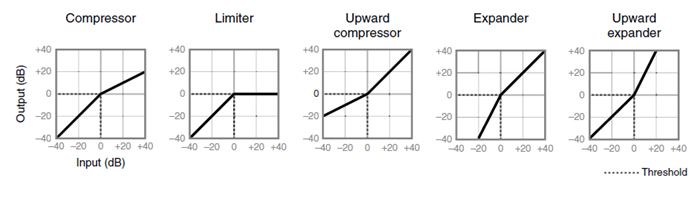
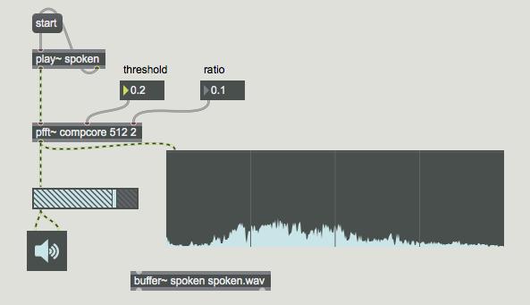
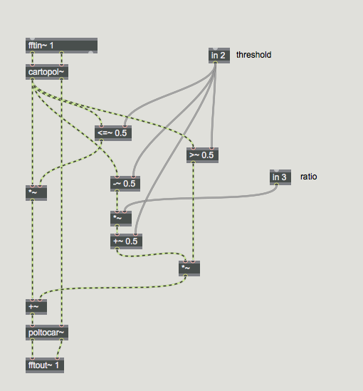
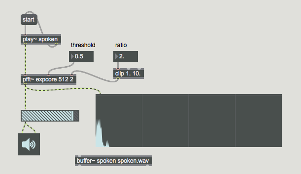
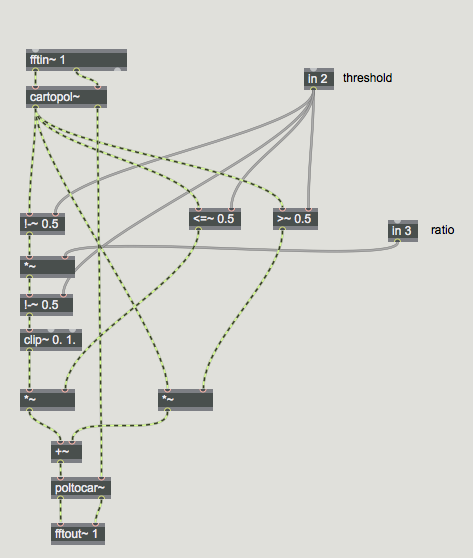

# Pfft~

## Anwendung 1: Spectral Gate

### Noise Gate

Übertragungsfunktion

Wenn der Pegel des eingegebenen Klangs unter *threshold* ist, wird der Klang sofort gemutet.

### Spectral Gate

Spectral Gate bedeutet *Noise Gate pro Bin*.
Wenn die Amplitude eines Bins unter *n* ist, wird der Bin sofort gemutet.

## Problem von FFT Programmierung

Fast alle FFT Programme benötigen:

- Fensterfunktion
- OLA (Overlapping and Add)

### Lösung = pfft~

pfft~ macht die Umsetzung von Fensterfunktion und OLA für uns.

### das Original

### mit pfft~

main patch

subpatch-gatecore

- pfft~ macht Fensturfunktion automatisch; wir müssen nicht programmieren.
- pfft~ macht auch OLA automatisch; wir müssen nur die Anzahl der Überlappung als Argument eingeben
- pfft~ benötigt ein Subpatch (Argument 1)
- Der Kernalgorithmus der Spektralverarbeitung muss im Subpatch ungesetzt werden
- pfft~ verwendet automatisch Hanning-Fenster aber man kann es ändern (Argument 2 von fftin~ und fftout~)

### Dynamic Control

### Spectral Compressor 

main patch

subpatch-gatecore

### Spectral Expander

main patch

subpatch-gatecore

 
