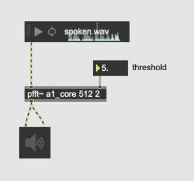
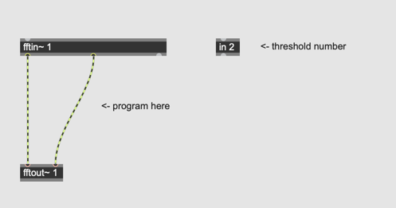
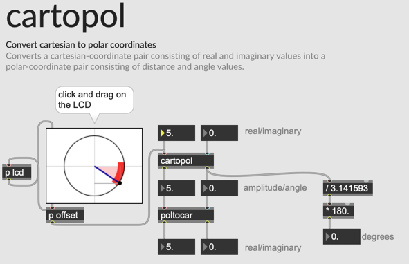
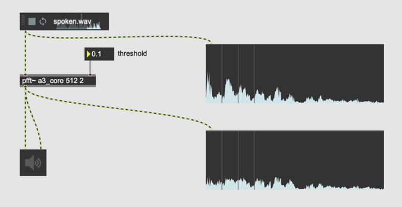
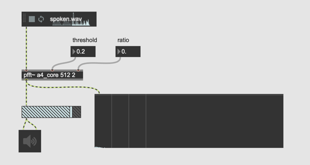

# K2. Spectral Dynamic Control

### Noise Gate

Transfer function

Noise Gate: If the level of the input signal is under the threshold, the input is muted. As the result, only loud sound is extracted.

### Assignment 1: Spectral Noise Gate

Apply the idea of noise gate to the frequency domain using [pfft~]
Examine the level of each bin. If it is above the threshold, the bin can go through the gate but if it is below the threshold, the bin is muted.

Expected Result:  

Hints:
- Use the following starter patch for this assignment
- with [in] object, we can send a parameter to pfft patch
- In order to get the magnitude of each bin, we can use the **pythagorean theorem**

  

### Assignment 2: cartopol~

[cartopol] object converts cartesian coordinate to polar coordinate.  [poltocar] object converts polar coordinate back to cartesian coordinate.
in the patch for assignment 1, use [cartopol~] and [poltocar~] to simplify the part of the pythagorean theorem 

### Types of Dynamic Control

### Assignment 3: Spectral Limiter

implement spectral limiter.
- calculate the magnitude of each bin
- if the magnitude exceeds the threshold, adjust the magnitude to the threshold

Hints:
- calculate reciprocal of the magnitude
- use clip to avoid divide by 0 problem
- the lower the threshold is, the noisier the sound becomes

### Assignment 4: Compressor

implement spectral compressor.
- two parameters **threshold** and **ratio** are available
- if the bin magnitude is above threshold, the magnitude of the bin is multiplied by **ratio**

### Assignment 5: Ratio of Compressor

if we set the ratio parameter of assignment 4 patch above 1, what kind of dynamic effect can we realize? What kind of sound effect is this?
