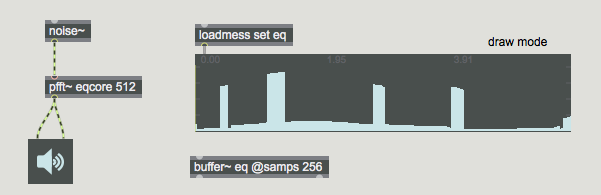
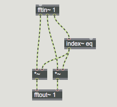
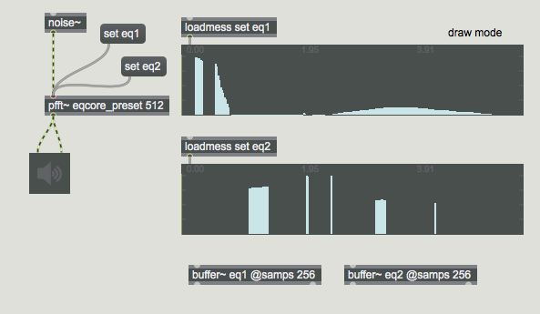
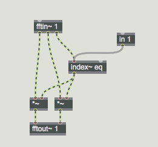
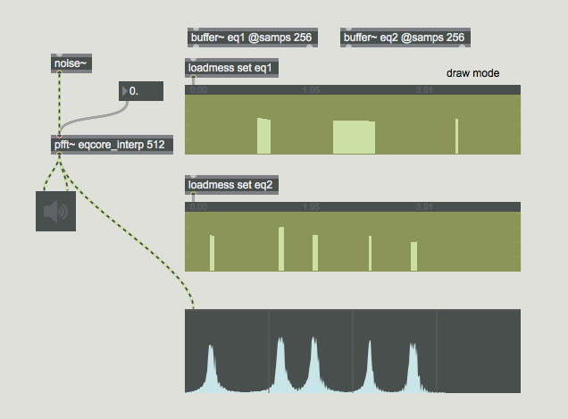
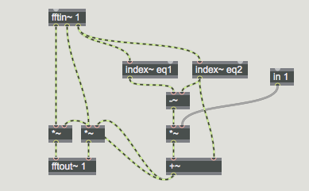
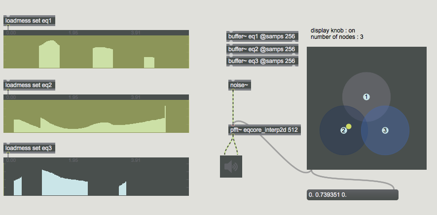
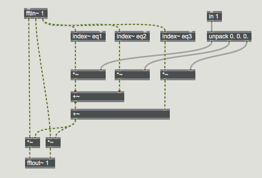

# Pfft~

## Anwendung 2: Spectral Graphic Equalizer

### Spectral Graphic EQ

##### main patch

##### sub patch

### Spectral Graphic EQ mit Presets

##### main patch

##### sub patch

### Spectral Graphic EQ mit Interpolation

##### main patch

##### sub patch

### Spectral Graphic EQ mit 2D Interpolation

##### main patch

##### sub patch

