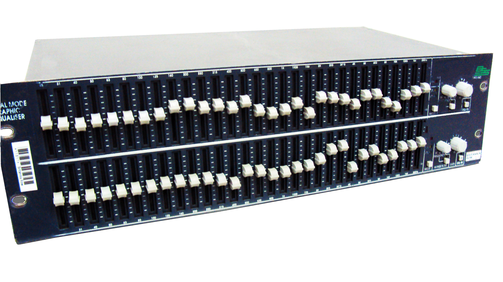
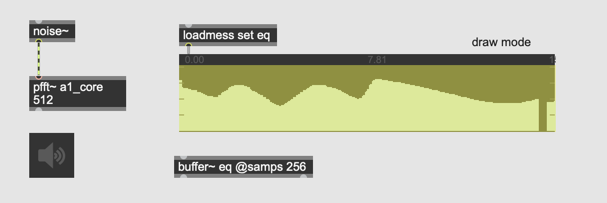
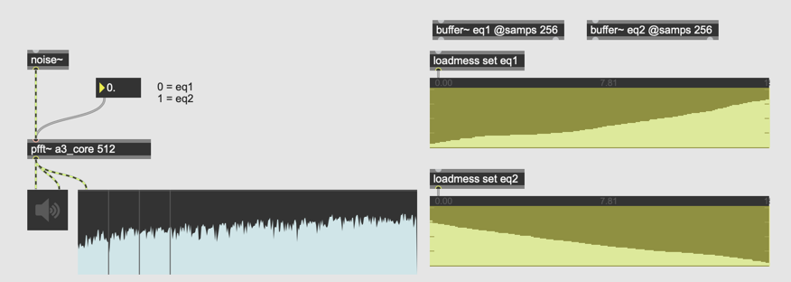

# K3. Spectral EQ

### Graphic EQ

enables us to control the level of many frequency bands precisely.
This device is commonly used by the SR engineer to cancel the room frequency response.

### Assignment 1: Spectral EQ

Using [pfft~] implement FFT-based graphic EQ in which the user can control the level of each frequency bin manually.
Use buffer~ named eq to control the amplitude of each bin.

Hints:

- [fftin~] 's 3rd outlet outputs bin index

- with [index~], we can read the value stored in a [buffer~]
- the value stored in a [buffer~] can be edited with a mouse using [waveform~]

### Assignment 2: Random EQ

using [uzi] and [peek~] objects, implement a patch that fills the buffer that [index~] points to with random values between 0 and 1 in order to randomize the level of every bins

### Assignment 3: Interpolation

Prepare one more [buffer~] for storing the EQ values in addition to the existing [buffer~].
Add one slider to the patch and with the slider interpolate two EQ setups.

### Assignment 4: Modulated EQ (advanced)

based on Assignment 1 patch, modulate the level of all bins at different speed.

