# Pfft~

## Anwendung 3: Spectral Freeze

### Basis

##### main patch

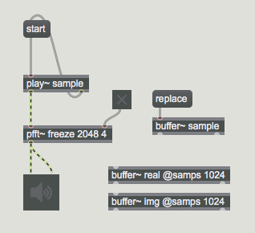

##### sub patch

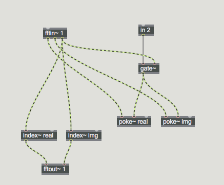

### Half-Frozen Spectrum

##### main patch

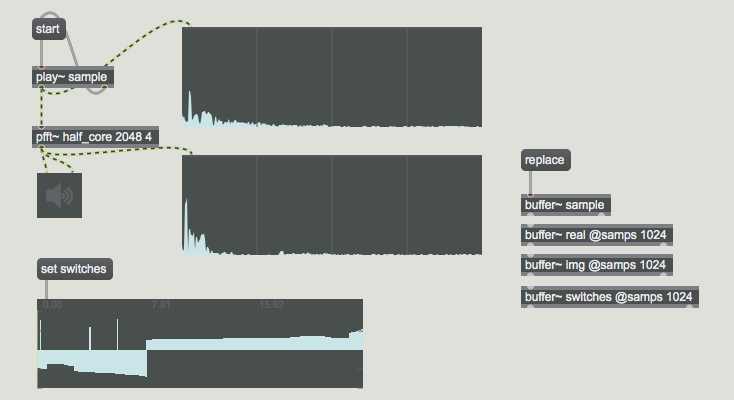

##### sub patch

##### switching automation

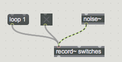

### Freeze + Gating

##### main patch

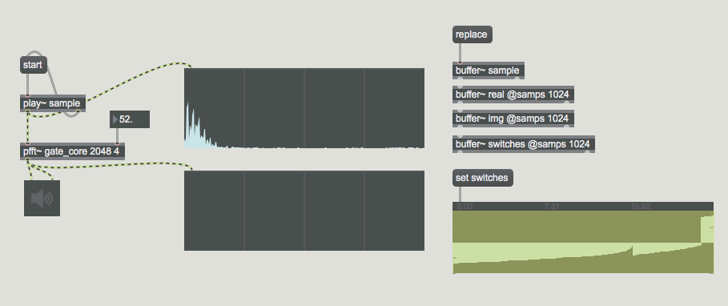

##### sub patch

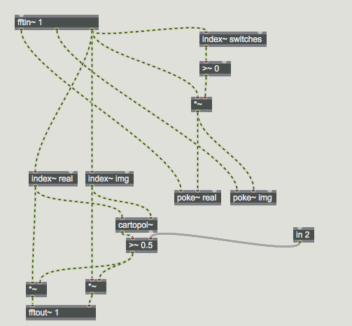

### Freeze + Decay

##### main patch
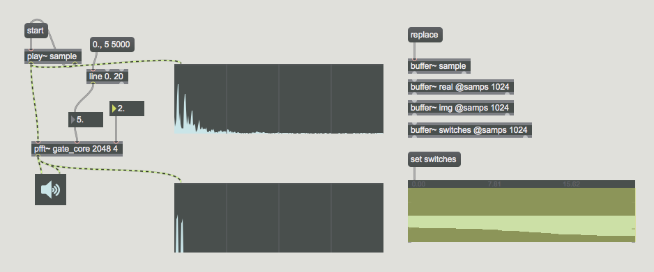

##### sub patch
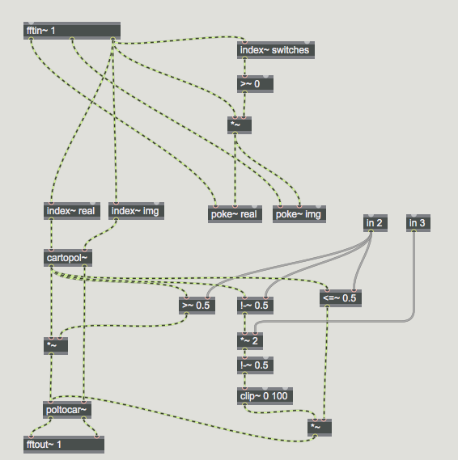

### Freeze als Filter

##### main patch
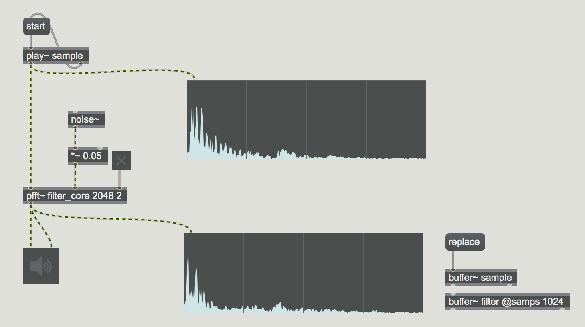

##### sub patch
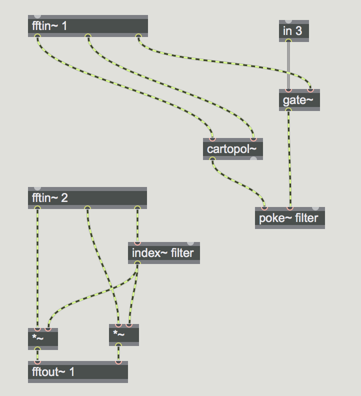

### Mehrere Spectral Freeze

##### main patch

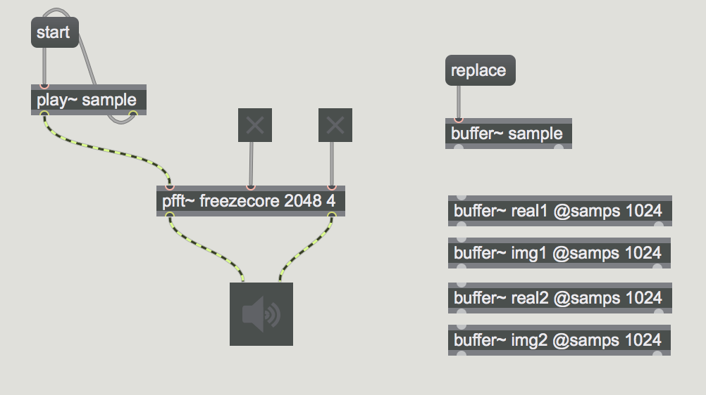

##### sub patch

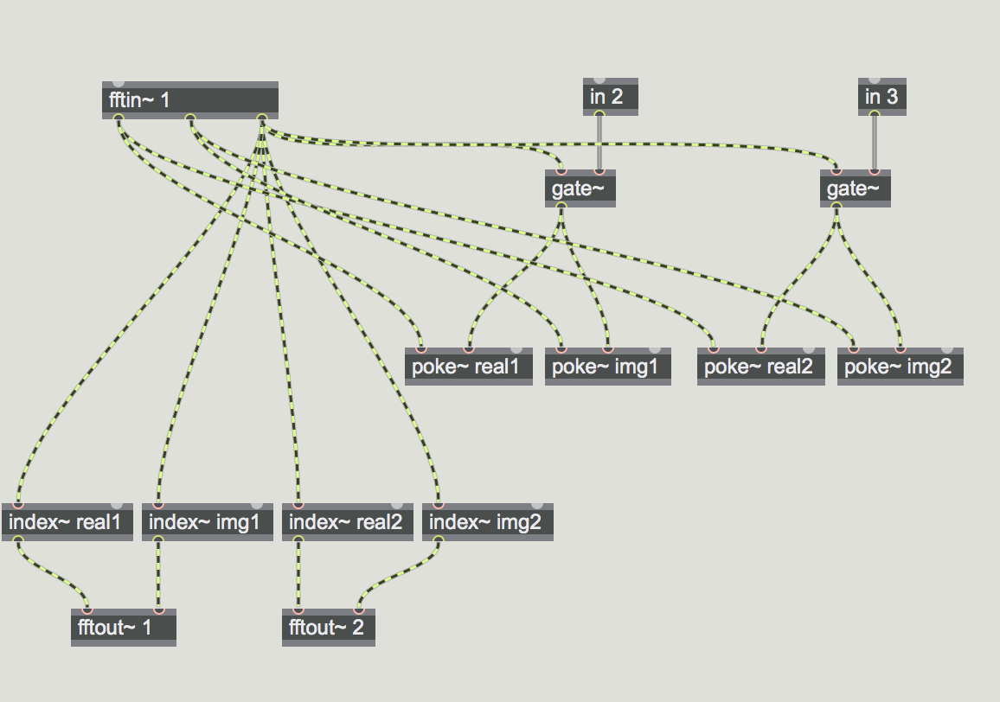

