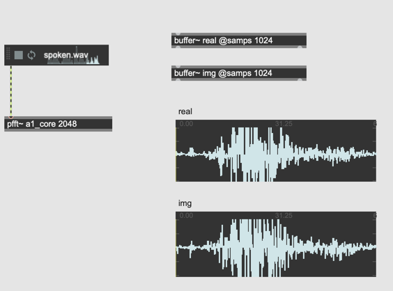
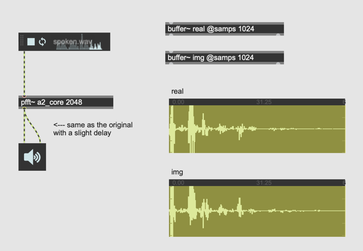
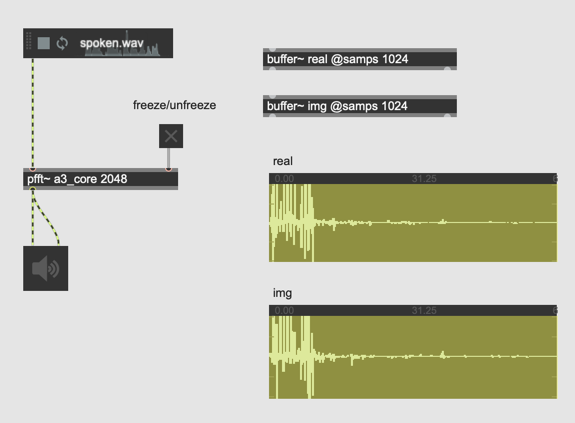
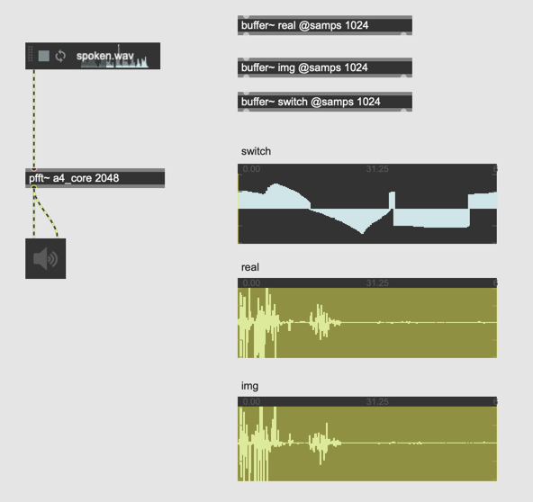
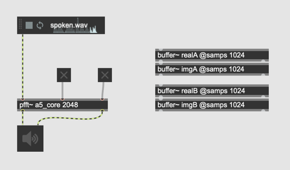

# K4. Frozen Spectrum / Spectral Stamp

### Assignment 1

Using [poke~], record the two outputs of [fftin~] continuously to two [buffer~] named "real" and "img" in [pfft~] and show the content of those two buffer~ using [waveform~]
The fft size has to be 2048. 

### Assignment 2: bypass playback via [buffer~]
In the [pfft~] patch of assigment 1, use two [index~] and read the contents of [buffer~] "read" and "imag" in realtime and feed the to [fftout~] so that [pfft~] outputs exactly the same signal as the inputted signal continously

### Assignment 3: frozen spectrum
We can hear the original sound from [pfft~] because we are continuously updating the content of two [buffer~]; if we stop updating them, we could be able to hear the "frozen spectrum" of a certain fft frame.

Add a mechanism to stop updating the content of [buffer~] using [poke~] by clicking a toggle outside the [pfft~] in order to create "frozen spectrum" effect.

### Assignment 4: per bin control
Extending the idea of assignment 3, make frozen/unfrozen states controllable for each 1024 bins using one more [buffer~] named "switch~"

### Assignment 5: More than one outputs 
In the patch for assignment 3, add one more [fftout~] to outputs the second frozen sound from the same input.

Hint: We need to add one more pair of buffer~ to store another "real" "imag" pair.

