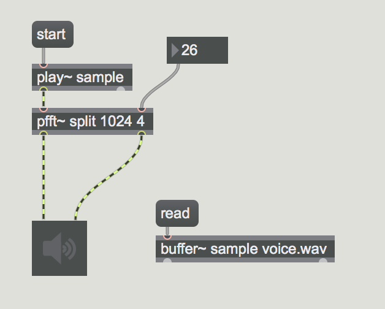
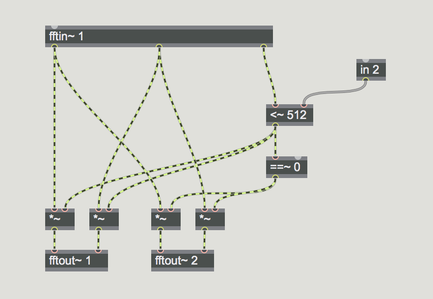
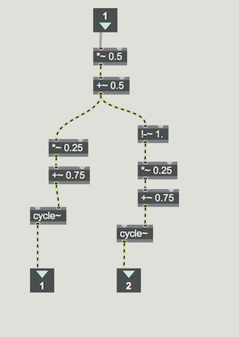
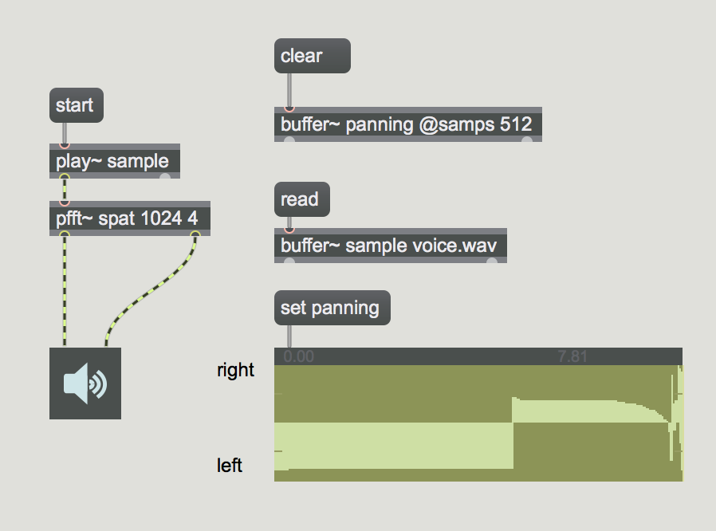
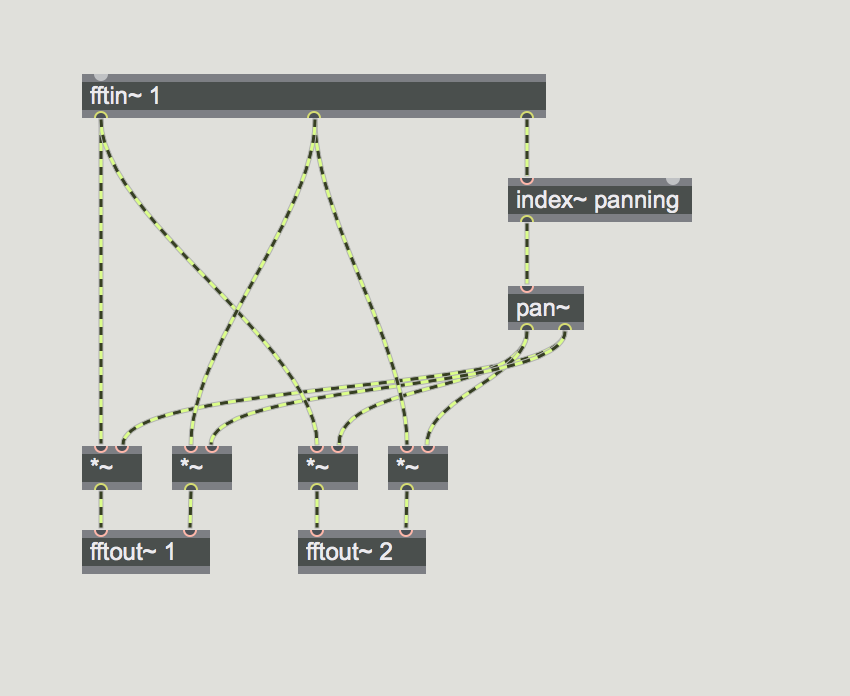
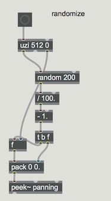

## Anwendung 4: Spectral Spatialization

### Spectral Splitting
trennung LR

##### main patch

##### sub patch

### Spectral Panning
panning pro bin

### Constant Power Panning

##### main patch

##### sub patch

##### panning randomization

