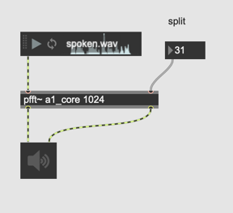
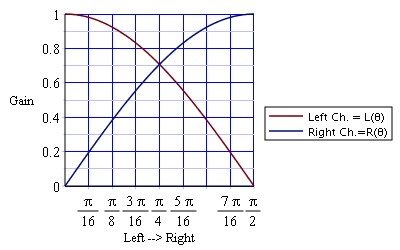
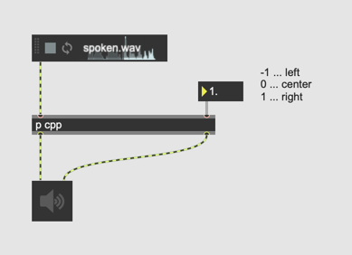
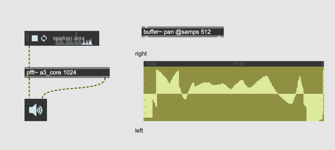

## K5. Spectral Spatialization

### Assignment 1: Spectral Splitting

Make a [pfft~]  that outputs the spectral components under bin N from its left outlet, the rest from its right outlet. N can be controlled by an integer box.
By connecting left and right outputs of [pfft~], send high frequency components to the speaker and low frequency components to the speaker to the left speaker.

### Assignment 2: Constant Power Panning
Review constant power panning and implement it by yourself

  

### Assignment 3: Spectral Panning
Make each spectral bin "panable" using a [buffer~] using constant power panning inside [pfft~]

### Assignment 4: Spectral Quad/Octa Panning (Advanced)

Extend the patch for assignment 2 and make it compatible with quadraphonic(4ch) or octaphonic(8ch) setup.
