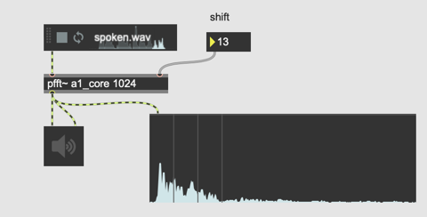
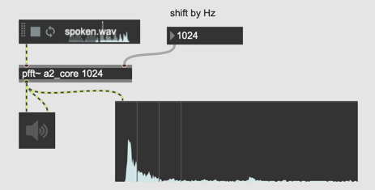
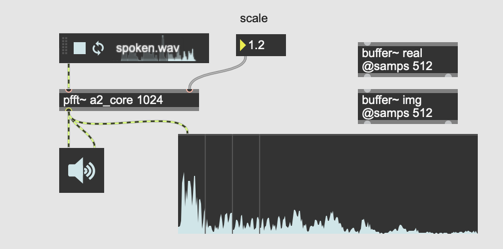

## K6. Spectral Delay und Decay

### Assignment 1: Spectral shifting
Each bin in pfft~ represents a spectral component of specific frequency range.
Theoretically, by displacing the spectral information of bin N to N+1, we can realize a kind of pitch shifting effect. Implement this "shifting bins" idea in a fft~.

Hint: delay~  

### Assignment 2: fbinshift~

[fbinshift~] object allows us to shift the spectrum, and it also enables the shift towards left (pitch down). Study the object [fbinshift~] and replace the delay~ used in the previous assignment.

### Assignment 3: Spectral scaling
Spectral shifting moves the entire spectrum left and right but theoretically we are also able to stretch or compress the spectral component. This is called spectral scaling. Implement the spectral scaling in a [pfft~] and make the scale factor controllable for the user

### Assignment 4: gizmo~

study [gizmo~] and replace [fbinshift~] in Assignment 2 patch with it. [gizmo~] object allows us to shift pitch using transposition ratio instead of the number of bins.

### Assignment 5: Spectral Delay

[delay~] and [fbinshift~] shift spectral component left and right in the same FFT frame but to apply delay that is a multiple of FFT  size (in our case, the block size is 1024 so 2048, 3072, 4096 etc). We can delay the bin information one FFT block.
This delay can be applied individually to each FFT bin. This is called spectral delay.
Implement spectral delay in pfft~

Hints:
- we can use buffer~ and waveform~ to control the delay time of each bin
- we have to force align the delay time to a multiple of FFT size
- [trunc~] is useful to truncate the decimal part of a floating point number

#### [vectral~]
works like [rampsmooth~] or [slide~] object it smooths the incoming signal. The difference between [vectral~] and [rampsmooth~] is that [vectral~] applies the smoothing function against a vector.

In the context of FFT,it applies smoothing function individually to each bin.

### Assignment 6: Spectral Decay (advanced)

In [pfft~] we can extract magnitude and phase information using [cartopol~]. apply decay function to the magnitude of each bin using [vectral~], keeping the phase information intact.
