## Anwendung 6: Spectral Delay und Decay

### Spectral Shift

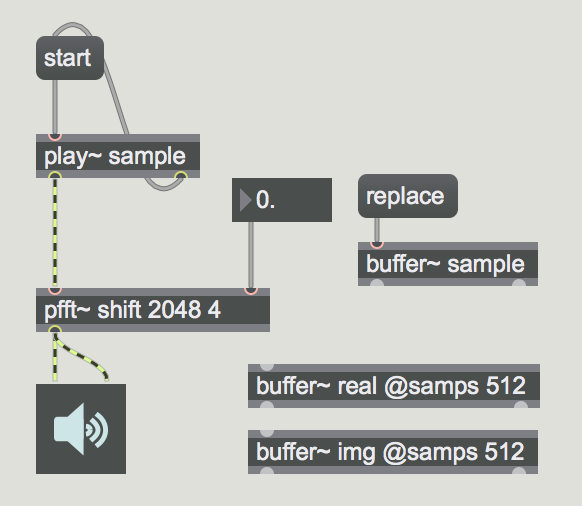
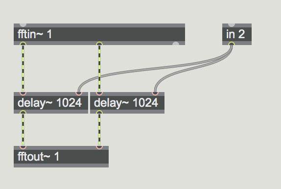

### Spectral Scale

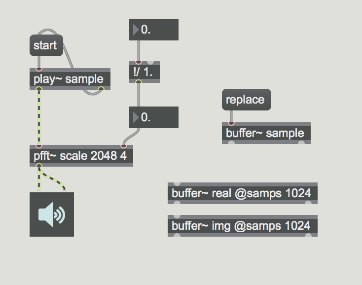
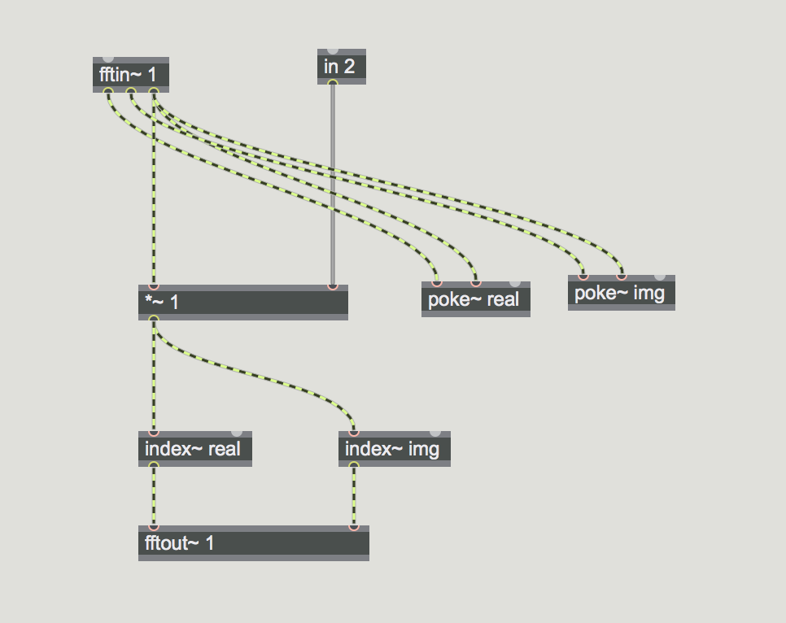

### fbinshift~

fbinshift~ funktioniert nur in einem pfft~ aber flexibler als delay~
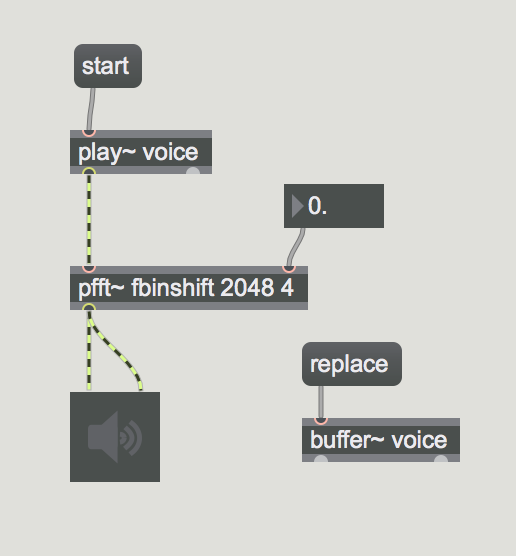
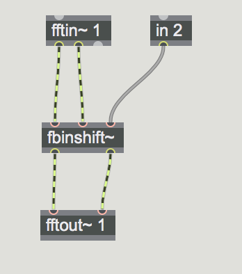

### gizmo~

gizmo~ analyziert das Spektrum 
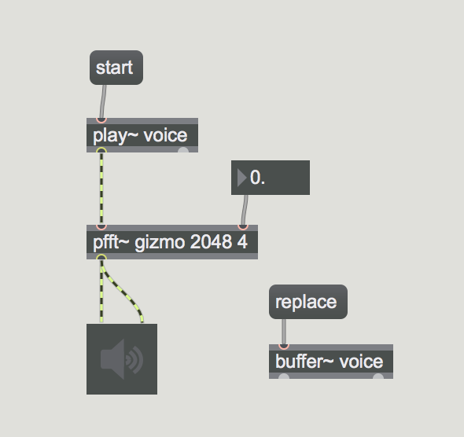

### Spectral Delay

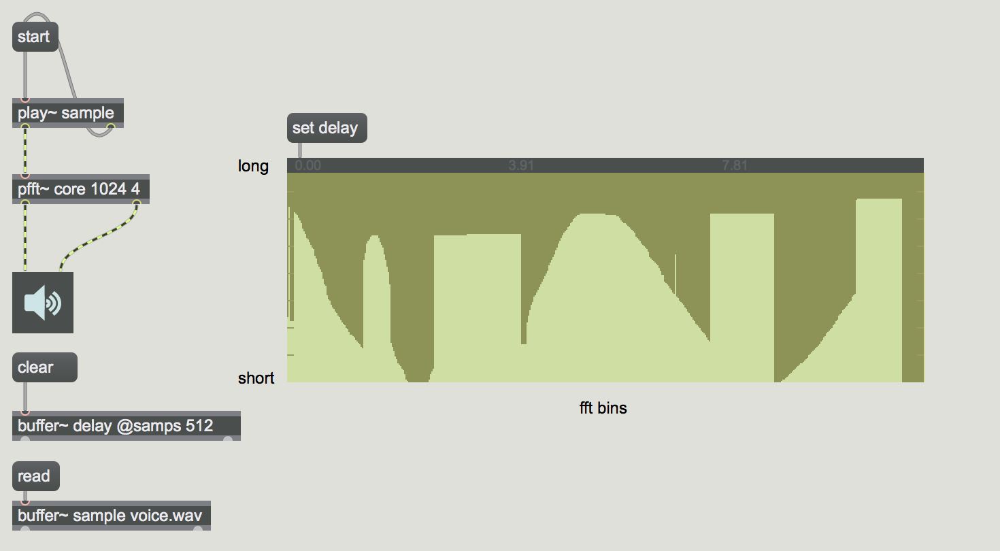

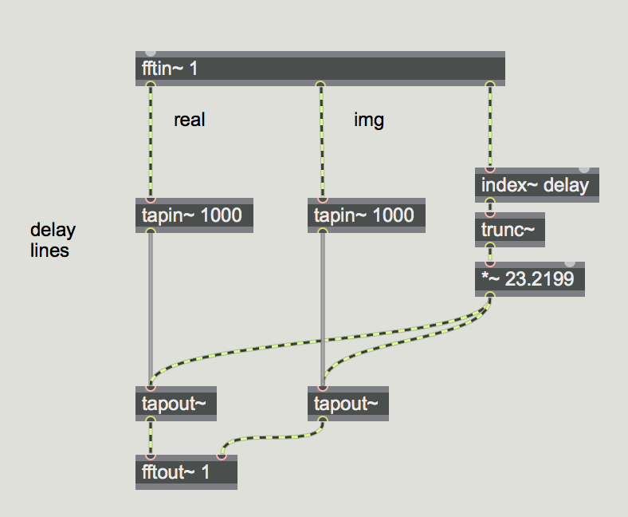

### Spectral Delay + Panning

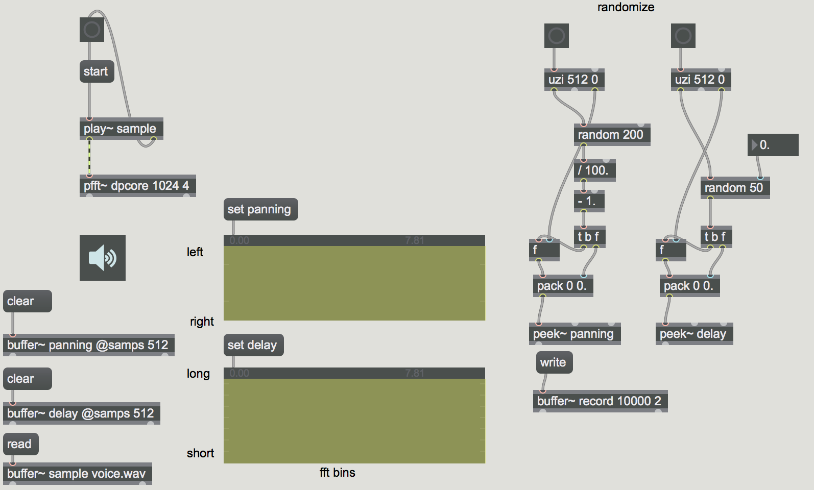

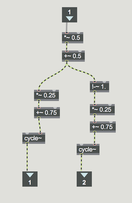

### Spectral Decay

#### vectral~

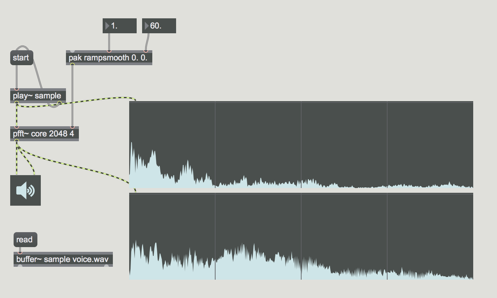
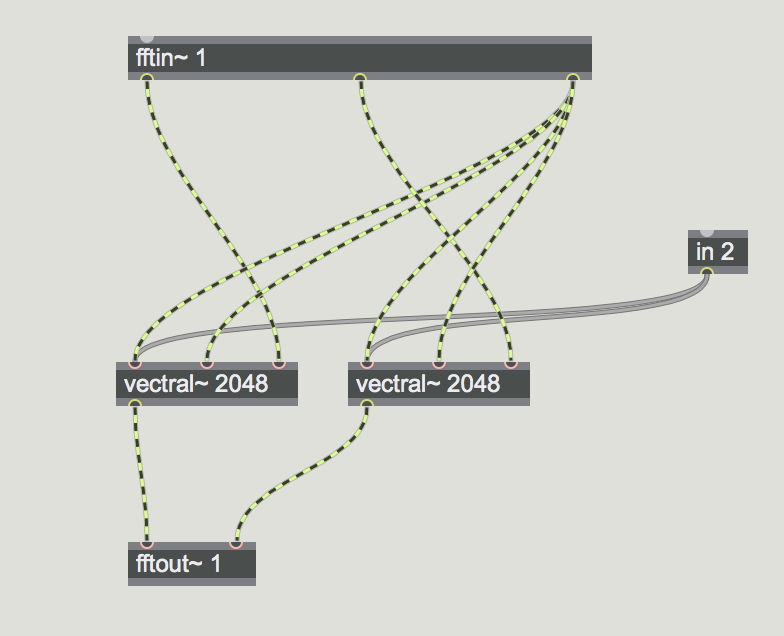

