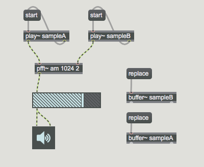
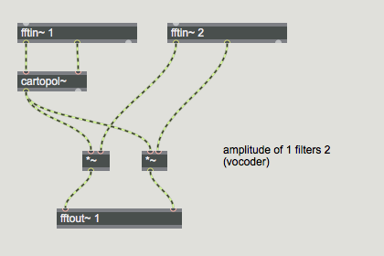
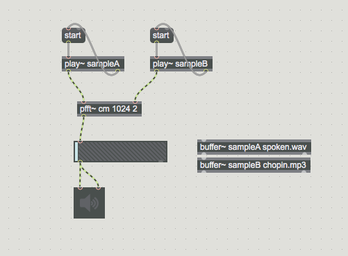
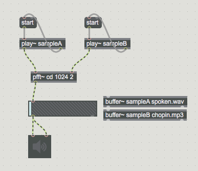
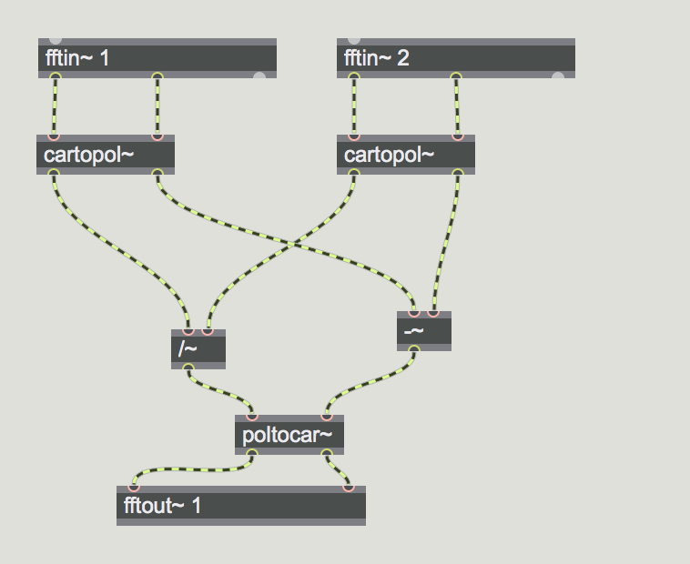
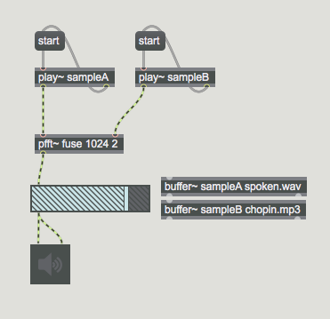
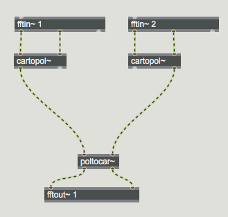

## K7. Cross Synthesis 

### Amplitude Multiplication

SampleA funktioniert wie einen Filter von SampleB
 

### Complex Multiplication

### Complex Division

### Magnitude von A + Phase von B

