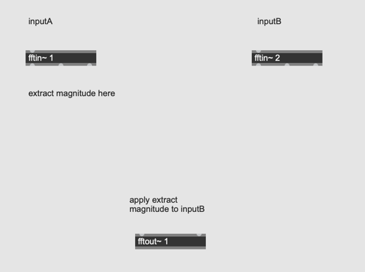
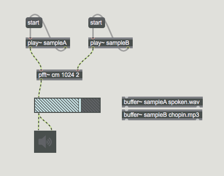

## K7. Cross Synthesis 

We can "fuse" two sound streams in many ways in pfft~ by making two inlets.

Samples: 
- [spoken.wav](k7/spoken.wav)
- [chopin.mp3](k7/chopin.mp3)

### Assignment 1: Amplitude Multiplication
Review K3 assignments and spectral EQ. 
Make two inputs in your FFT patch and analyze the magnitude of inputA and use it as the EQ for inputB.
In this way, we can filter inputB with the spectrum of inputA.
The input for inputB should be rich in spectrum otherwise no sound will be outputted from the [pfft~]

Use [spoken.wav](k7/spoken.wav) as inputA and white noise as inputB for the first time. Then, try with different audio samples.

### Assignment 2: Spectral Stamping
In assignment 1, the filter of inputA is continuously updated every FFT frame. Review K4 "spectral freeze" and make the magnitude of inputA "freezable" with a toggle outside [pfft~] patch.

Hint: 
[in] object  and [buffer~] is required

### Assignment 3: Asymmetricality
Swap the sound sources for inputA and B and check the difference of the output.

### Assignment 4: Complex Multiplication
[fftin~] outputs complex number (a pair of real and imaginary number). We can multiply two complex numbers.
Unlike Amplitude Multiplication in assignment 1, in which one spectrum filters another, this produces equally "fused" sound.

Hint: [Complex Multiplication](https://www.cuemath.com/numbers/multiplying-complex-numbers/)

### Assignment 5: Complex Division
We can also divide inputA with inputB.

Hint: [Complex Devision](https://www.cuemath.com/numbers/division-of-complex-numbers/)

### Assignment 6: Another combinations

Explore the combinations of inputA and inputB creatively
- use real of inputA and imag of inputB
- use magnitude of inputA and phase of inputB
- adding magnitude of inputA and inputB but subtracting phase of inputB from inputA

