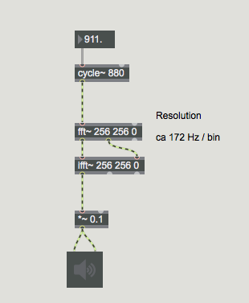
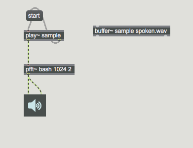
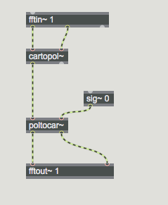
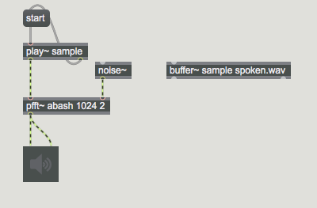
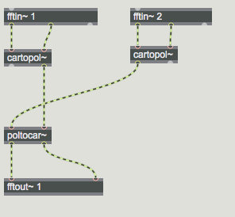
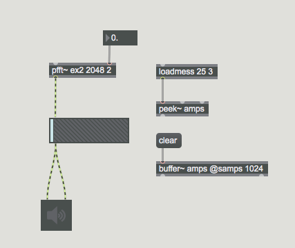
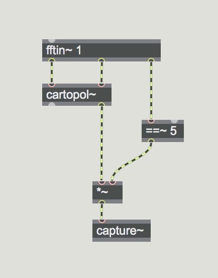

# Phase und FFT

## Frage 1

Warum funktioniert das?




## Experiment 1 (Phase bash)






## Experiment 2 (Mag rand)






## Phase Vocoder Guide
[Phase Vocoder 1](https://cycling74.com/tutorials/the-phase-vocoder-%E2%80%93-part-i)

```
The difference between the phase values of successive FFT frames for a given bin determines the exact frequency of the energy centered in that bin. 
```

## Frage 2

Kann man in pfft~ einen Klang ohne Quelle synthetisieren?





