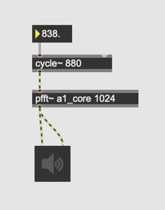
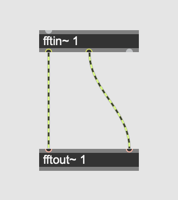
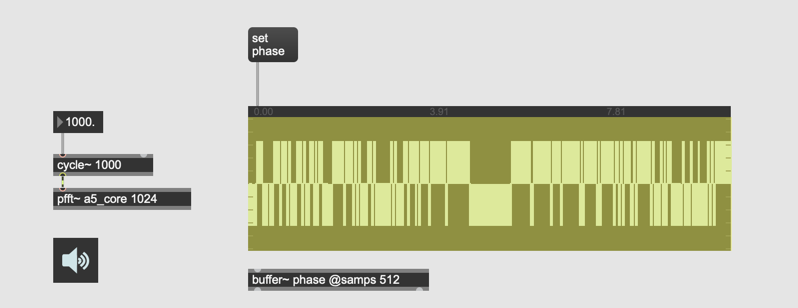

# K8. Phase and FFT

### Assignment 1: Magic happens

Implement the following [pfft~] patch and gradually change the frequency of the sine wave.
fft~ frame size is 256. The range each frequency bin covers is 172Hz. but we can here 10 Hz difference clearly.
Why does this work?

### Assignment 2: Phase information removal
In assignment1 patch, convert cartesian values to polar values, using [cartopol~], discard the phase information from [cartopol~] and use [sig~ 0]  to nullify the phase and convert them back to cartesian values. How does it sound?

#### Insight
Phase determines the exact frequency of the energy centered in that bin. 

### Assignment 3: Robot voice
Use [spoken.wav](k8/spoken.wav) instead of sine wave in the assignment 2 patch. 
Change the size of FFT frame and listen to the difference.

### Assignment 4: pfft~ as a synthesizer
We have been using [pfft~] to process sound but if we are able to generate complex number in pfft~ we could use [pfft~] as a sound generator.  Try to synthesize sound in [pfft~] without feeding audio signal to [fftin~]

Hint:
- You can still use [fftin~] to receive bin index
- We can create magnitude data by reading a [buffer~] using [index~] in [pfft~]
- for phase, we can use [sig~ 0]

#### Insight
[pfft~] can generate sound if we generate proper numbers in [pfft~]

### Assignment 5: Phase observation
Set SR = 48k, Feed a 1k Hz. sine wave to [pfft~].
Convert the complex number to polar values and visualize phase of all bins in a waveform~ and observe the content.
What's the maximum value and minimal value of the out?

#### Insight
- Phase information is expression between pi and -pi 
- They are dynamic

### Assignment 6: Check one bin
Using [capture~] in [pfft~] check the phase progression of bin 6. where frame size is 256.
change the frequency of cycle~ and check the phase progression again.

### Assignment 7: Check the delta of the bin

[framedelta~] object outputs the delta (difference) between current FFT and previous FFT blocks.
Using [framedelta~] observe the delta value that the sine wave produces in Assignment 5.

#### Insight
- By feeding a sine wave, the increment of the phase is constant
- By changing the sine wave frequency, the increment of the phase is altered

### Assignment 8: frameaccum~

like [accum~], [frameaccum~] accumulates the incoming signal and outputs the result for each bin.
This means, with this object we can simulate phase progression as we observe in the previous two assignments.
Using [frameaccum~] extend the patch for Assignment 4 and control the central frequency of the bin by changing the increment fed to [frameaccum~]

