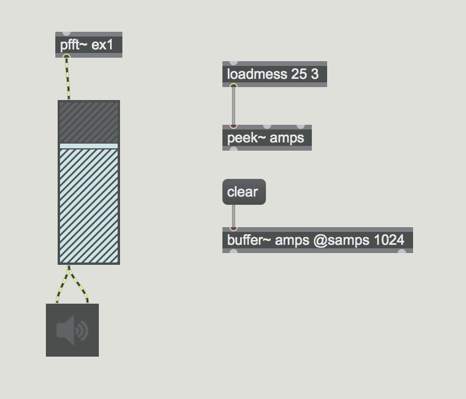
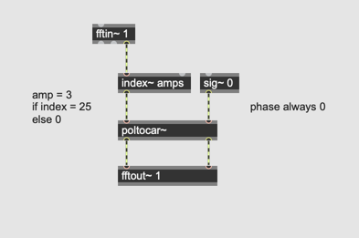
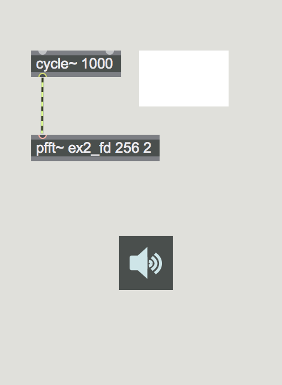
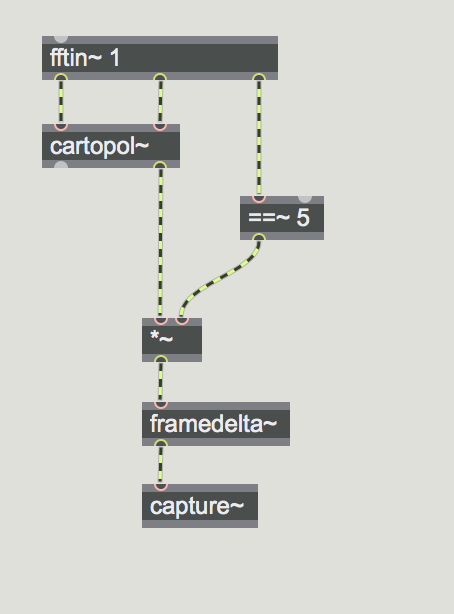
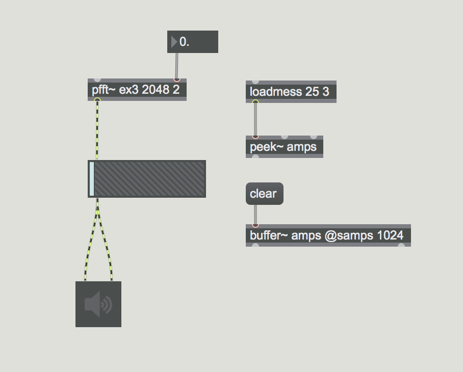
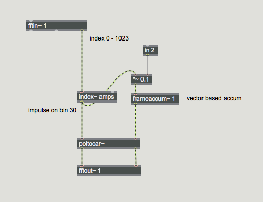

# K8. Phase and FFT

## Assignment 1

Why does this work?


## Assignment 2 (Phase bash)
In assignment1 patch, convert cartesian values to polar values, using [cartopol~], discard the phase information from [cartopol~] and use [sig~ 0]  to nullify the phase and convert them back to cartesian values. How does it sound?

## Phase Vocoder Guide
[Phase Vocoder 1](https://cycling74.com/tutorials/the-phase-vocoder-%E2%80%93-part-i)

```
The difference between the phase values of successive FFT frames = 90


determines the exact frequency of the energy centered in that bin. 
```

## Assignment 3
Try to synthesize sound in pfft~ without feeding audio signal to [fftin~]

Hint:
We can create magnitude data by reading a [buffer~] using [index~] in [pfft~]

### Assignment 4

Feed a 1k Hz. sine wave to pfft~, convert the input spectrum to polar representation and observe the phase progression of one specific bin (e.g. bin 5)




### Assignment 5

[framedelta~] object outputs the delta (difference) between current FFT and previous FFT blocks. 

Using [framedelta~] observe the delta value that the sine wave produces in Assignment 5.


#### mit framedelta~




### Versuch 3



