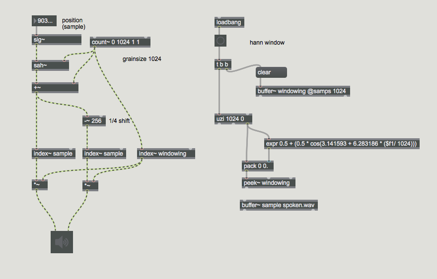
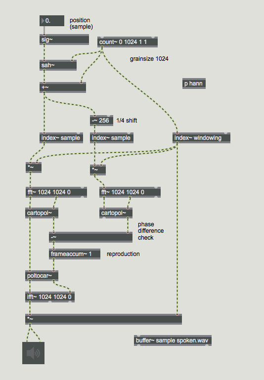
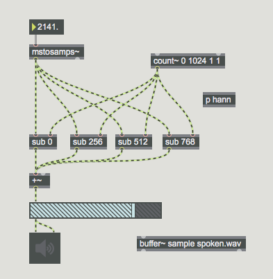
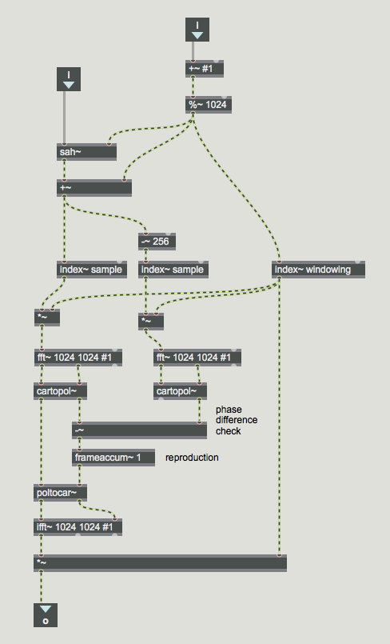

# The Phase Vocoder 1

## Vox 5 von Travor Wischart

[Vox 5](https://youtu.be/y23kobWHs8M) on youtube

## Phase Vocoder Tutorial von C. Lippe und R. Dudas.
[Phase Vocoder 1](https://cycling74.com/tutorials/the-phase-vocoder-%E2%80%93-part-i)

Time Streching + Pitch Shift mit FFT

### Schritt 1 - Granulator

### Schritt 2 - FFT von Grain

### Schritt 3 - OLA

1024 FFT frame size
4 overlaps 

Main Patch

Sub Patch

